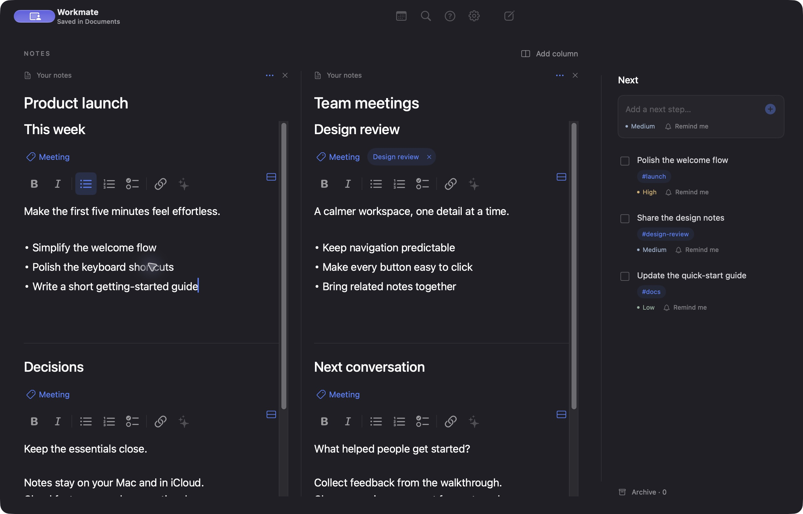
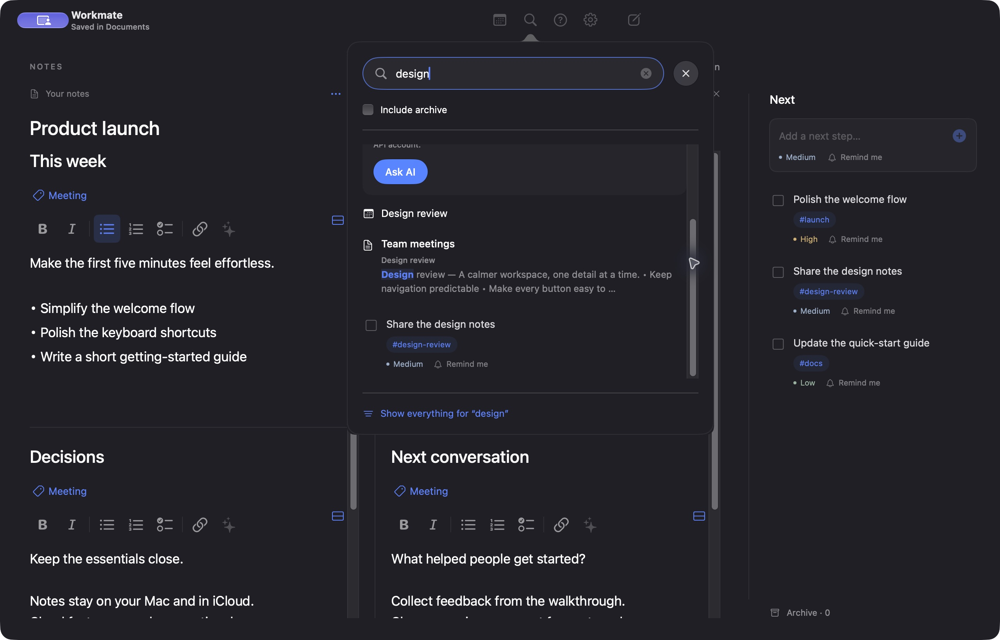
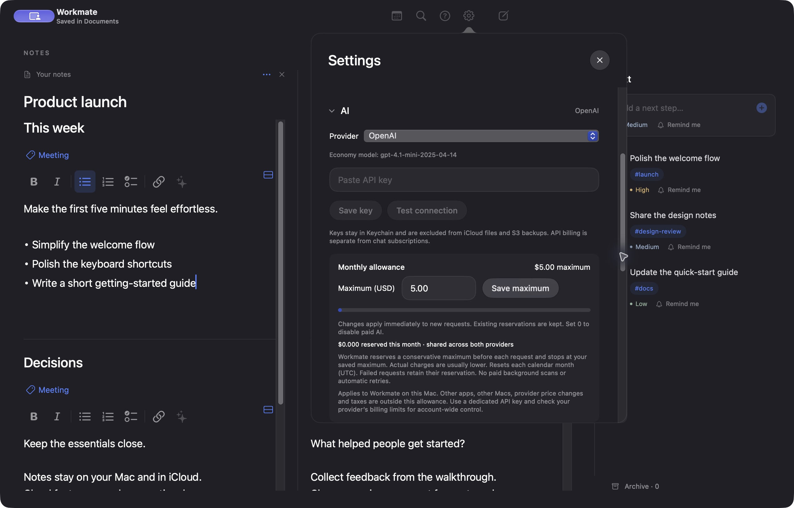

# Workmate for Mac

**A native home for notes, meetings, and next steps.**

[](https://github.com/rashwanlazkani/Workmate/actions/workflows/checks.yml)
[](LICENSE)


[Get started](#build-locally) · [Screenshots](#screenshots) · [Optional AWS setup](Cloud/README.md) · [Contribute](CONTRIBUTING.md)

Work often gets split between meeting notes, task lists, and reminders. Decisions lose their context, follow-ups get buried, and finding what you agreed last week means searching across tools.

Workmate brings your notes, meetings, and next steps into one Mac workspace. Keep notes side by side, link sections to recurring meetings, turn selected text into an action, and search related notes and tasks together. Your files stay in your own Documents or iCloud Drive folder; AI and cloud services are optional.

Workmate is a native **SwiftUI + AppKit** macOS app. The client is entirely Swift, with no web view, JavaScript runtime, or local server. Node is only needed if you maintain the optional AWS backend.



- **Write and organize:** rich text, checklists, named columns, and sections with their own meeting tags.
- **Keep the next step visible:** prioritized tasks, reminders, completion, and a searchable archive.
- **Find the context:** search notes, meetings, and tags with highlighted matching snippets.
- **Choose your extras:** optional AI with your own key and monthly allowance; optional AWS in your own account.

## Screenshots

The screenshots below show the actual native app with fictional demo notes. Click an image to view it at full size.

<details>
<summary><strong>Search across notes, meetings, and tasks</strong></summary>

Search results show the matching section, highlighted text, and related tasks. Ordinary search runs locally; “Ask your notes” is optional.



</details>

<details>
<summary><strong>Bring your own AI key and choose a monthly maximum</strong></summary>

Choose Apple Intelligence, OpenAI, or Anthropic. Cloud providers use your own API key, stored in Keychain. The editable allowance defaults to $5 per month for Workmate on this Mac; set it to $0 to disable paid AI. It is not a provider-wide billing cap.



</details>

## Build locally

The built app supports macOS 14+. Building requires **Xcode 26+ (Swift 6.2+ and the macOS 26 SDK)** or matching Command Line Tools, even when targeting older macOS versions. Apple Intelligence additionally requires supported hardware and macOS 26+.

```sh
git clone https://github.com/rashwanlazkani/Workmate.git
cd Workmate
zsh Scripts/test.sh
zsh Scripts/build.sh
open Workmate.app
```

**No account, API key, AWS deployment, Node installation, or paid Apple Developer membership is needed for the native app.** Notes, sections, rich text, search, tasks, meetings and local notifications work independently. Files use your iCloud Drive when available, otherwise local Documents.

The script produces `Workmate.app` with ad-hoc signing by default. macOS may ask for privacy permissions again after each ad-hoc rebuild. For stable permissions, use your own signing identity:

```sh
WORKMATE_SIGNING_IDENTITY="Apple Development: Your Name (TEAMID)" zsh Scripts/build.sh
```

Build output is kept in the macOS temporary directory. No third-party Swift packages are required. Source builds are not notarized distribution releases.

## Optional services

| Feature | What you provide | Required? |
| --- | --- | --- |
| Local notes, search and Mac reminders | Nothing | Built in |
| iCloud Drive file sync | Your Apple Account / iCloud Drive | Optional |
| Apple Intelligence | Supported Mac and macOS | Optional |
| OpenAI or Anthropic | Your API key; editable monthly allowance | Optional |
| S3 backup and Telegram delivery while the app is closed | **Your AWS account and your own backend deployment**; your Telegram bot | Optional |

Workmate does not provide a shared hosted backend. No maintainer AWS account or endpoint is configured in new installs. AWS charges are separate from the in-app AI allowance. See [AWS setup](Cloud/README.md), [contributing](CONTRIBUTING.md), and [security](SECURITY.md).

## License

[MIT](LICENSE). Contributions are welcome.

## Project layout

- `Sources/Workmate/` — native interface, calendars, notifications, and on-device AI.
- `Sources/WorkmateCore/` — workspace models, storage, search, and cloud client.
- `Tests/` — Swift tests.
- `Resources/` — app metadata and icon.
- `Scripts/` — native build, test, and icon tools.
- `Cloud/` — optional AWS backend source and deployment tools. See `Cloud/README.md`.

## Working with notes and meetings

The interface uses a charcoal `#1F1F24` background, white text, and `#5482FF` blue accents, with consistent glass buttons and anchored native SwiftUI popovers.

Write in side-by-side note columns. Each note has a compact native formatting toolbar for bold (⌘B), italic (⌘I), bullets, numbered lists, clickable checklists and links (⌘K). Return continues a list; Return on an empty item ends it. Formatting is saved with the note in iCloud and AWS backups, alongside plain text for search and AI. Add tasks inline and choose Low, Medium, High, or Urgent priority. Reminder controls offer quick presets and native calendar/time controls. Open a task to add lowercase tags. Existing meeting names and reused tags are suggested; click a saved tag to search. Tags matching a meeting name also include the task in that meeting’s focused view. There is no task due-date field. Completing a task moves it into Archive; uncheck it to restore it.

The calendar control is always visible. Open it to create a meeting, search all existing meetings, or filter to one meeting’s notes and actions. Choose **One-time** for a dated meeting or **Recurring** for any combination of weekdays, with separate start/end times for each selected day. Reminders default to ten minutes before. Connect selected macOS calendars in Settings to include events from accounts already configured in Calendar. Workmate reads those calendars without editing their events. Clicking a meeting notification or the current meeting in the toolbar opens its related notes and actions. Use **Meeting** beneath a note to link an existing meeting or create another. A newly created meeting links to that note automatically. Linked meetings appear as clickable metadata tags above the note title.

Search with **⌘F** for notes, tasks, and meetings, including items linked through meeting metadata. Tick **Include archive** to include completed tasks. Use **⌘N** for a new note and **⌘,** for Settings. Text-entry views focus their first editable field when opened. Closing the red window button leaves the app running; its Dock icon or **⌘0** brings the workspace back.

Optional Apple Foundation Models intelligence scans notes on this Mac to suggest meeting links, summaries, and action points. Suggestions need your review and never overwrite note text. Manual linking and search work without Apple Intelligence.

## Your data

Workmate uses the current Mac user's iCloud Drive. Its main folder is **iCloud Drive → Documents → Workmate**:

- `workspace.json` — readable notes, tasks, meeting links, archive, priorities and reminder settings.
- `config.json` — portable preferences and the private, workspace-scoped AWS connection key.
- `insights-local.json` — on-device AI suggestions.
- `Recovery/` — migration copies and preserved conflicting edits.

Settings → **Show files in Finder** opens the exact folder. There is no Workmate sign-in. macOS handles iCloud uploads and downloads using your existing Apple Account. The app reports that a file was saved in iCloud Drive, not that Apple's upload has finished. If iCloud Drive is unavailable at first launch, files are saved in local `Documents/Workmate`; configure iCloud Drive and move the folder there before reopening Workmate to switch locations.

Existing native data is migrated automatically on first launch, without replacing an existing iCloud workspace or deleting the previous files in `~/Library/Application Support/Workmate`. The earlier browser data and backups remain there too. The app coordinates file reads/writes with macOS, checks for changes from other devices, and merges independent edits. Conflicting versions are preserved in Recovery, with an in-app notice. Export/import accepts the readable workspace JSON.

## AWS backup and Telegram

Disabled by default. Deploy the backend to **your own AWS account**, then run the provisioning command in [Cloud/README.md](Cloud/README.md) against your private Workmate folder. No app rebuild is needed. AWS administrator credentials stay in your CLI profile, never in Workmate. Existing users keep their explicitly provisioned connections.


The private connection lives in the Workmate folder, so another Mac using the same iCloud Drive can use it without a new account. **Keep config.json private**: its key grants access to this workspace's AWS copy and Telegram connection. It contains no AWS administrator credentials and is never bundled in the application or project.

Your AWS deployment (default region **eu-north-1 / Stockholm**) keeps immutable, encrypted S3 snapshots and a DynamoDB copy for reminder scheduling and Telegram updates. iCloud files remain the main workspace. S3 has versioning and blocks public access. Backup failures leave local edits intact and retry while the app runs. Settings shows backup status and has **Back up now**. Pausing backup stops future uploads; reminders already scheduled in AWS may still arrive.

Under **Settings → Telegram**, open BotFather, send `/newbot`, paste its token, connect, then open the pairing link and tap Start. Bot tokens are held in AWS Secrets Manager and excluded from workspace backups. Each action's reminder offers **Also notify in Telegram**. Mac notifications are always included, subject to macOS notification permission. Choose which priorities to send under **Daily brief**.

AWS EventBridge Scheduler delivers opted-in task reminders, meeting reminders and daily briefs while Workmate is closed. No separate device or agent is required. Telegram reminders have **Mark complete** and **Snooze 1 hour** buttons with visible confirmation. Native Mac reminders offer the same actions. Edits must sync before closing the app. Recurring meeting schedules use the meeting timezone; AWS skips nonexistent local times at the spring DST transition. Imported calendars refresh while Workmate runs.

## Help and first launch

A four-step welcome tour appears on first launch and can be skipped. Open **Help → Workmate Help**, the toolbar **?**, or **Settings → Help & getting started** for searchable topics. Choose **Welcome Tour…** or **Restart tour** to replay it. Tutorial completion is remembered on this Mac. Popups remain open when you switch apps. Press Escape to close the active popup, including from a text or time field. You can also close it explicitly, or finish with Save, Cancel or a selection.

Notes can contain stacked sections in one column. Use **Add section** for a new heading, or the section icon beside the formatting toolbar → **Split at cursor** to move the text below the cursor into a new section. **Merge with section above** keeps both sections’ text and formatting. Sections remain part of the same searchable note and iCloud/AWS backup.

Each note section has its own **Meeting** selector and removable meeting tags. Meeting focus shows only that meeting’s sections; search includes section meeting links. Existing note-level links move to the original first section. Splitting keeps the tags on both parts; merging retains both sections’ links.

For notes with multiple sections, the large title at the top names the whole column independently; each section has its own heading. Formatting controls use larger icons, 17-point body text and larger list markers.

Use the section menu → **Delete section…** to remove a section after confirmation. The column name and other sections stay saved; deleting the final section leaves an empty editor.

Highlight note text to show a floating **Make action** button beside the end of the selection. It follows the selected text and disappears when the selection is cleared or the editor loses focus.

Search results include a snippet around matching text, highlighted search terms, and the matching section heading. Meeting-only matches identify the meeting link.

Action rows and button surfaces use their full visible area as the click target, including spacing inside reminder rows and labeled toggles.

### Optional AI (2.9)

Settings → AI lets you choose Apple Intelligence (on device), OpenAI GPT-4.1 mini, or Anthropic Claude Haiku 4.5. Paste your own API key into the secure field, save it to macOS Keychain, then test the connection. API keys are device-only and never included in workspace JSON, iCloud Drive, S3, or logs. Provider choice is local. Chat subscriptions do not cover API charges.

Select text and click the sparkle in its formatting toolbar to improve writing, fix spelling, shorten, translate, make bullets, or organize headings. Review the original and generated preview before replacing. Only the captured selection changes, edits have native Undo, and replacement refuses if the section changed in the meantime. Truncated cloud responses are never applied.

Search → Ask your notes ranks small passages locally and sends at most six displayed passages only when Ask AI is clicked. Answers cite source IDs, with links back to the source sections. This is bounded local keyword retrieval plus AI synthesis, not a complete semantic/vector index; answers may miss evidence outside the displayed passages. Ordinary search remains instant, offline, and free. AI receives note content as untrusted data and is instructed not to execute embedded instructions.

The shared OpenAI/Anthropic allowance defaults to $5 per UTC calendar month **for Workmate on this Mac**. Before each request, an atomic, process-locked Application Support ledger reserves twice the current list-price upper estimate using UTF-8 byte counts plus message overhead and the 1,200-token output cap. Reservations persist across restart, key changes, provider changes, crashes and timeouts, and are not refunded automatically. This deliberately overstates spend; actual charges are usually much lower. Corrupt/unreadable budget state blocks paid requests. Repeated identical requests use an in-memory cache; there are no background paid scans, tools, hosted search/vector storage, paid embeddings, or automatic retries. Apple Intelligence remains free and outside this allowance.

Set a different monthly maximum in Settings → AI (USD, up to two decimal places). Set 0 to disable new paid requests. Changing the maximum never clears reservations; lowering it below current usage blocks further requests immediately. The limit is saved with the locked ledger and persists across restarts and month changes.

This local guard is not a provider-account billing guarantee: usage by other apps/Macs, taxes, deleted application data, clock changes and provider price changes are outside its scope. For account-wide control use a dedicated provider account/project and configure the provider's available billing controls. Economy models and rates are pinned in `AIService.swift` (verified October 5, 2026); reassess before changing model IDs. Budget controls must never be bypassed by fallback or retries.
